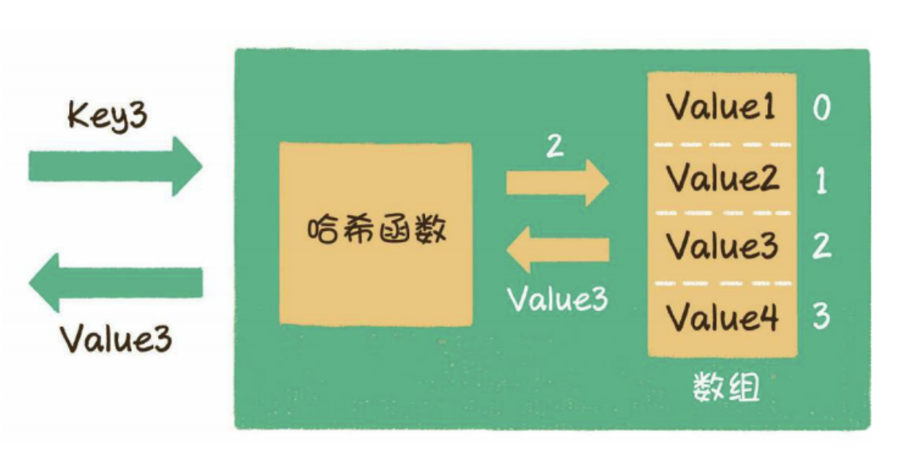
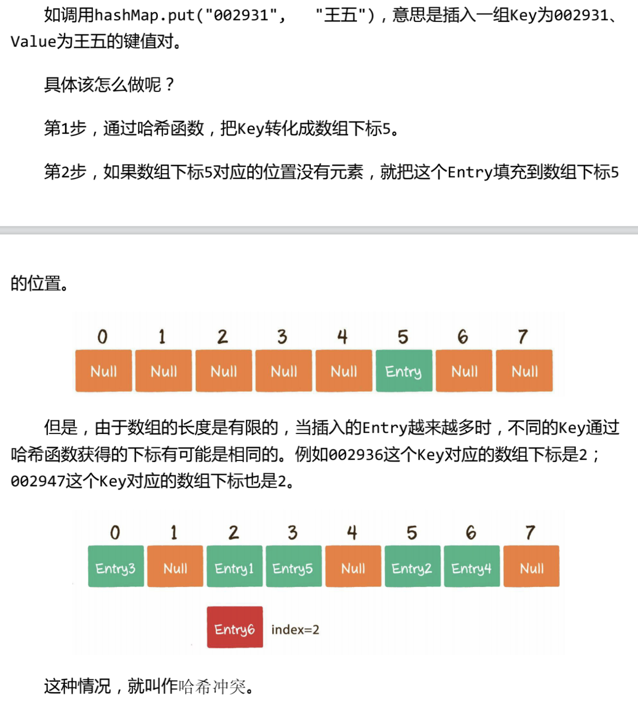
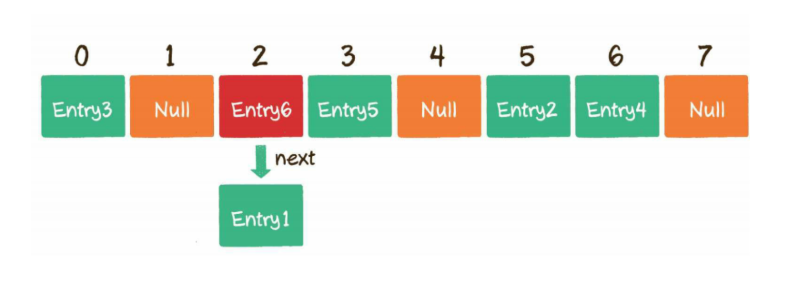
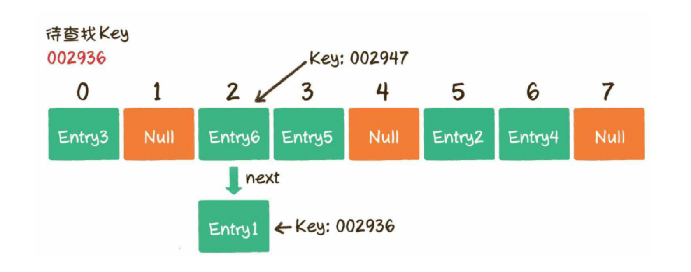
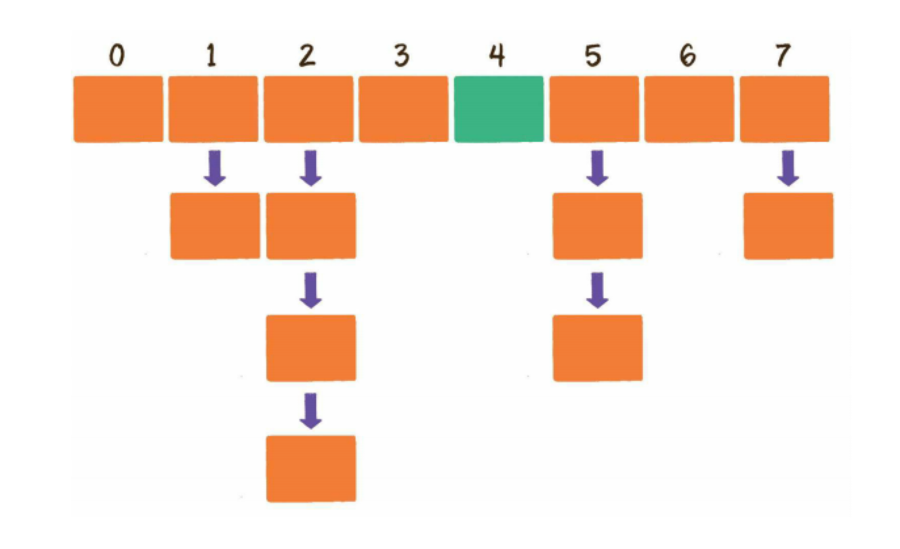

## 一、题目
697. 数组的度

给定一个非空且只包含非负数的整数数组 nums，数组的 度 的定义是指数组里任一元素出现频数的最大值。

你的任务是在 nums 中找到与 nums 拥有相同大小的度的最短连续子数组，返回其长度。


示例 1：

```
输入：nums = [1,2,2,3,1]
输出：2
解释：
输入数组的度是 2 ，因为元素 1 和 2 的出现频数最大，均为 2 。
连续子数组里面拥有相同度的有如下所示：
[1, 2, 2, 3, 1], [1, 2, 2, 3], [2, 2, 3, 1], [1, 2, 2], [2, 2, 3], [2, 2]
最短连续子数组 [2, 2] 的长度为 2 ，所以返回 2 。

```
示例 2：
```
输入：nums = [1,2,2,3,1,4,2]
输出：6
解释：
数组的度是 3 ，因为元素 2 重复出现 3 次。
所以 [2,2,3,1,4,2] 是最短子数组，因此返回 6 。
```

提示：
```
- nums.length 在 1 到 50,000 范围内。
- nums[i] 是一个在 0 到 49,999 范围内的整数。
```

来源：力扣（LeetCode）
链接：https://leetcode-cn.com/problems/degree-of-an-array/


## 二、分析解题思路
根据案例一和案例二的解释可以得出：我们需要找出一个数组中的相同数，且还要找出相同数在数组中第一次出现和最后一次出现的位置，这两个位置组成区间长度就是`这个数组的度`。当数组中含有多个「相同数」的时候，则取区间长度最短的那个。

通过上面我们把题目分析理解清楚后。 可以接着思考如何用算法写出这道题的答案。

- 需要借用哈希列表的数据结构来存储记录每个数出现的次数。 以及每个数出现的第一次出现的下标位置和最后一次出现的下表位置。 
- 记录在哈希列表后， 再遍历哈希列表。对比出现相同数的最大个数`MaxNum`，做比较，然后计算出该相同数的第一次出现的和最后一次出现的长度`minLen`
- 最后得到最小的度

## 三、JS代码

var findShortestSubArray = function(nums) {
    const mp = {} //初始化哈希函数

    // 使用Object.entries() 将对象输出为可枚举的键值对数组 for...of循环
    // 哈希数组存储 例如：[1,2,2,3,4,5,6,2,3]
    //  mp[1][0] = 3 // 记录每个数出现的个数
    //  mp[1][1] = [i,i];//记录， 第一次出现的下表
    // mp[1][2] = i //记录每个数最后一次出现的下标记right
    for(const [i,num] of nums.entries()){
        if(num in mp){
            mp[num][0]++;
            mp[num][2] = i;
        }else {
            mp[num] = [1,i,i]
        }
    }

    let maxNum = 0, minLen =0;
    for(const[count,left,right] of Object.values(mp)){
        if(maxNum <count){
            maxNum = count;
            minLen = right - left +1;
        }else if(maxNum === count){
            if(minLen >(right-left+1)){
                minLen = right - left +1;
            }
        }
    }
    return minLen
}

## 四、总结
### 4.1 知识点
这两天刷到2题关于哈希表的用法解题了，对哈希表印象模糊，于是再来梳理总结下《漫画算法》和《算法图解》中介绍的哈希表（散列表）

#### 1、散列表（哈希列表）概念
散列表也叫 哈希列表（hash table）,这种数据结构提供了键（Key）和值（Value）的映射关系。只要给出了一个Key，就可以高效查到它所匹配的Value，时间复杂度接近于O(1)

#### 2、哈希函数 
充当“中转站”作用，通过某种方式，把Key和数组下标进行转换。



**实现方式**：
- Java中常用集合HashMap为例
- 大多数面向对象的语言中，每个对象都有属于自己的hashcode，这个hashcode是区分不同对象的重要表识。无论对象自身的类型是什么，他们的hashcode都是一个整型变量
- 获取数组的下标转化方式： index = HahsCode(key) % Array.length
- JDK中的哈希函数并没有直接采用取模运算，而是利用了位运算的方式来优化性能。

#### 3、读写操作
##### 写操作（put）
在散列表 中插入新的键值对（JDK中叫做Entry）


**哈希冲突解决方案**
1、 开放寻址法：

当一个key通过哈希函数获取得对应的数组下标以被占用时候，我们可以“另谋高就”，寻找下一个空档位置


2、链表法
应用在了Java的集合类HashMap中

HashMap数组的每一个元素不仅是一个Entry对象，还是一个链表的头节点。每一个Entry对象通过next指针指向它的下一个Entry节点。 当新来的Entry映射到与之冲突的数组位置时，之需要插入到对应的链表中即可



##### 读操作（get）
读操作就是通过给定的Key，在散列表中查找对应的value

具体操作：
- 如调用hashMap.get("002936")
- step1:通过哈希函数，将Key转化为数组下标 2.
- step2：找到数组下标2所对应对元素，如果这个元素对Key是002936，那么就找到了；如果这个Key不是002936也没关系。由于数组对每个元素都与一个链表对应，我们可以顺着链表慢慢往下照， 看看能否找到与Key相匹配对节点。


##### 扩容（resize）
散列表达到一定饱和度时，Key映射位置发生冲突大概率会逐渐提高。这样一来，大量元素拥挤在相同的数组下标位置，形成很长的链表，对后续插入操作和查询操作的性能都有很大影响，这时，散列表就需要扩展它的长度， 也就是进行扩容.


#### 3、小结
散列表（哈希函数）是一种功能强大的数据结构，其操作速度快，还能让你以不同的方式建立数据模型。
- 你可以结合散列函数和数组来创建散列表
- 冲突很糟糕，你应该使用可以最大限度减少冲突的散列函数
- 散列表的查找、插入和删除速度都非常快。
- 散列表适合用于模拟映射关系。
- 一旦填装因子超过0.7，就该调整散列表的长度
- 散列表可以用于缓存数据（例如：在Web服务器上）
- 散列表非常适用于防止重复。

### Object.entries()
`object .entries()`方法返回一个给定对象自身可枚举属性的键值对数组，其排列与使用 `for...in` 循环遍历该对象时返回的顺序一致（区别在于 `for-in` 循环还会枚举原型链中的属性）。

例如：
```
const object1 = {
  a: 'ayuan',
  b: 24
};

for(const [key,value] of Object.entries(object1)){
    consolo.log(`${key}:${value}`)
}
// 输出：
// "a:ayuan"
// "b:24"
```

#### 语法
```
Object.entries(obj)
```
参数：`obj` 可以返回其可枚举属性的键值对的对象。

返回值： 给定对象自身可枚举属性的键值对数组

描述：
`Object.entries()`返回一个数组，其元素是与直接在`object`上找到的可枚举属性键值对相对应的数组。属性的顺序与通过手动循环对象的属性值所给出的顺序相同.

#### 运用： 将`Object`转换为`Map`
`new Map()` 构造函数接受一个可迭代的`entries`。借助`Object.entries`方法你可以很容易的将`Object`转换为`Map`:
```
var obj = { foo:'Hecate',baz:42};
var map = new Map(Object.entries(obj));
consoloe.log(map); // Map{foo:'Hecate',baz:42}
```