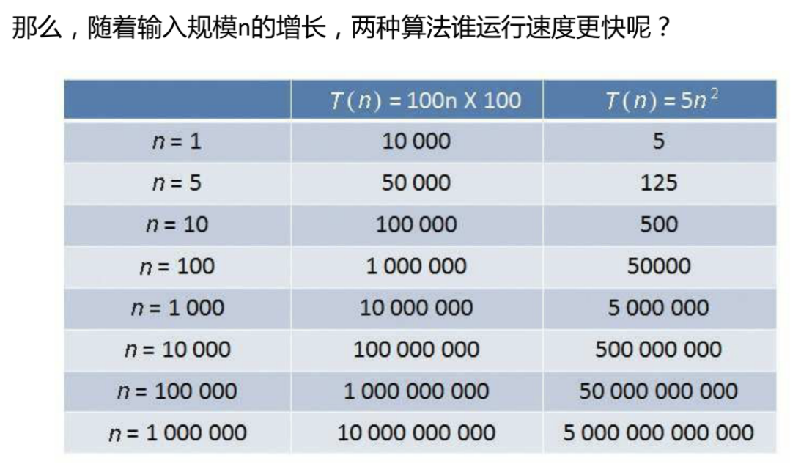

## 一、题目

给你一个整数数组 `citations` ，其中 `citations[i]` 表示研究者的第 `i `篇论文被引用的次数。计算并返回该研究者的` h`指数。

根据维基百科上`h指数的定义`：`h` 代表“高引用次数”，一名科研人员的 `h`指数是指他（她）的 （`n `篇论文中）总共有 `h` 篇论文分别被引用了至少 `h`次。且其余的 `n - h`篇论文每篇被引用次数 不超过 `h` 次。

如果 `h` 有多种可能的值，`h` 指数 是其中最大的那个。

示例 1：
```
输入：citations = [3,0,6,1,5]
输出：3 
解释：给定数组表示研究者总共有 5 篇论文，每篇论文相应的被引用了 3, 0, 6, 1, 5 次。
     由于研究者有 3 篇论文每篇 至少 被引用了 3 次，其余两篇论文每篇被引用 不多于 3 次，所以她的 h 指数是 3。
```

示例 2：
```
输入：citations = [1,3,1]
输出：1
```

提示：
```
- n == citations.length
- 1 <= n <= 5000
- 0 <= citations[i] <= 1000
```

来源：力扣（LeetCode）
链接：https://leetcode-cn.com/problems/h-index

## 二、分析解题思路
### 2.1 思路一:排序
- 首先看到`h`个元素大于等于某个值，`N-h`个元素小于等于某个值，这显然是一个有序序列的特征， 所以可以将数组先进行排序
- 将数组排序之后，对于给定的某个i，我们知道有`citations.length - i 篇论文的引用数 >= citaions[i]`,`i篇论文的引用数 <= citations[i]`
- 如果让`h=citation.length-i`,即至少都有h篇论文分别被引用了至少`citation[i]`次，其余`citation.length-h `篇论文的引用数不多于`citation[i]`次。
- 最后，只要`citation[i]>=h`，就满足本题了

## 三、JS代码
### 3.1 思路一之排序代码：
```
 var hIndex = function(citations) {
    citations.sort((a,b) => a-b)
    for(let i=0; i<citations.length; i++){
        let h = citations.length - i;
        if(h <= citations[i]){
            return h;
        }
    }
    return 0;
};

let arr = [1,3,1]
let result = hIndex(arr);
console.log(result) 
// 1
arr = [3,0,6,1,5]
result = hIndex(arr);
console.log(result) 
// 3

```
#### 复杂度：
时间复杂度：O(n)
空间复杂度：O(1)


## 四、总结

### 4.1 回顾下复杂度如何计算
#### 4.1.1时间复杂度

##### 4.1.1.1 概念
时间复杂度是执行算法的时间成本，空间复杂度是执行算法的空间成本

##### 4.1.1.2 算法的好与坏
坏的：1、运行时间长； 2、占用空间大

运行时间的长短和占用内存空间的大小，是衡量程序好坏的重要因素

代码绝对执行时间是无法预估的，但是可以预估代码的基本操作执行次数

##### 4.1.1.3 基本操作执行次数
`T(n)`: 程序基本操作执行次数的函数【程序的相对执行时间函数】，`n`：输入规模

案列：

> 场景一： T(n) = 3n， 执行次数是线性的
>
> 场景一： T(n) = 5logn， 执行次数是用对数计算的
>
> 场景三： T(n) = 2，执行次数是常量
>
> 场景四： T(n) = 0.5n^2 + 0.5n,执行次数是用多项式计算的


##### 4.1.1.4 渐进时间复杂度
概念：
- 若存在函数`f(n)`,使得当`n`趋近于无穷大时，`T(n)/f(n) `的极限值为不等于零的常数，则称`f(n)`是`T(n)`的同数量级函数。
- 记作 `T(n) = O(f(n))`,称为 `O(f(n))`，`O`为算法的渐进时间复杂度，简称为时间复杂度
- 因为渐进时间复杂度用大写`O`来表示， 所以也称为`大O表示法`

如何推导时间复杂度(推导原则):

- 1、如果运行时间是常数量级，则用常数1表示
- 2、只保留时间函数中的最高阶项
- 3、如果最高阶项存在，则省去最高阶项前面的系数

场景：
> 一： `T(n) = 3n`，最高阶项为`3n`，省去系数`3`，则转化的时间复杂度：  `T(n)=O(n)`
>
> 二： `T(n) = 5logn`,最高阶项为 5logn，省去系数，转化的时间复杂度为： `T(n) = O(logn)`
>
> 三： `T(n) =2` ,只有常数量级，则转化的时间复杂度为：`T(n)=O(1)`
>
> 四： `T(n)=0.5n^2 + 0.5n`,最高阶项目为 0.5 n^2 ,则转化的时间复杂度为： `T(n)=O(n^2)`
>
> 以上四种复杂度究竟谁的程度执行用时更长，谁更节省时间？ 当n的取值足够大时，可以得出：`O(1)<O(logn)<O(n)<O(n^2)`

##### 4.1.1.5 其他形式的时间复杂度：
`O(nlogn)`、`O(n^3)`、`O(mn)`、`O(2^n)`、`O(n!)`


##### 4.1.1.6 时间复杂度的巨大差异


从上面的表格可以看出，当n的值很小的时候， 算法A的运行用时要远大于算法B；
当n的值在1000左右时，算法A和算法B的运行时间已经比较接近；
随着n的值越来越大，甚至达到十万、百万时，算法A的优势开始显现出来，算法B的运行速度则越来越慢，差距越来越明显。

#### 4.1.2 空间复杂度
##### 4.1.2.1概念
- 概念：时间复杂度是执行算法的时间成本， 空间复杂度是执行算法的空间成本
- 内存空间是有限的， 在时间复杂度相同的情况下， 算法占用的内存空间自然是越小越好
- 空间复杂度是对一个算法在运行过程中临时占用存储空间大小对量度，它同样使用了大O表示法
- 程序占用空间大小的计算公式记作： S(n) = O(f(n)), 其中n为问题的规模， f(n) 为算法所占存储空间的函数


##### 4.1.2.2 空间复杂度的计算
1、常量空间 `O(1)`

当算法的存储空间大小固定，和输入规模没有直接的关系时，空间复杂度为：`O(1)`

2、线性空间

当算法分配的空间是一个线性的集合（如数组），并且集合大小和输入规模n成正比时，空间复杂度记作：`O(n)`

3、二维空间 

当算法分配的空间是一个二维数组集合，并且集合的长度和宽度都与输入规模n成正比时，空间复杂度记作：`O(n^2)`

4、递归空间

递归场景比较特殊，虽然代码中并无显示地声明变量或集合，但是计算机在执行程序时，会专门分配一块内存，用来存储“方法调用栈”

方法调用栈
- 进栈:一个新方法执行入栈操作，把调用的方法和参数信息压入栈中
- 出栈:当方法返回时，执行出栈操作， 把调用的方法和参数信息从栈中弹出

执行递归所需要的空间复杂度:`O(n)`:
- 执行递归操作所需要的内存空间和递归的深度成正比。
- 纯粹的递归操作的空间复杂度也是线性的，如果递归的深度是n，那么空间复杂度就是O(n)

##### 4.1.2.3 时间和空间的取舍
- 评估算法的时间和空间复杂度，根本原因是因为计算机的运算速度和空间资源是有限的
- 绝大多数时候， 时间复杂度更为重要一些， 所以宁可多分配一些内存空间，也要提升程序的执行速度。 
- 空间复杂度离不开数据结构。【散列表、数组、二维数组】

