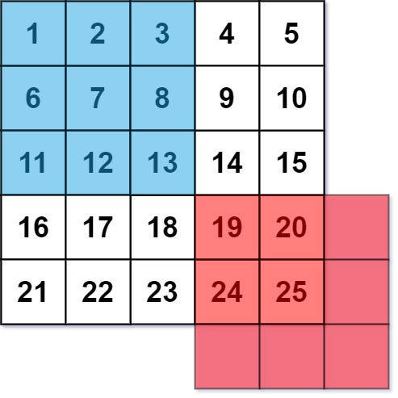
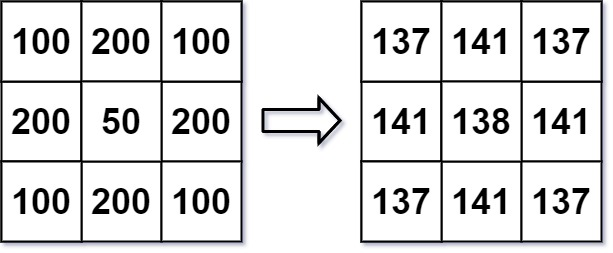

## 一、题目
661. 图片平滑器
图像平滑器 是大小为` 3 x 3 `的过滤器，可以计算是周围的8个单元和它本身的值求平均灰度(即蓝色平滑器中9个单元的平均值)来应用于图像的每个单元。如果一个单元的一个或多个周围的单元不存在，我们不考虑它的平均值(即红色平滑器中的四个单元的平均值)。




给定一个代表图像灰度的 `m x n` 整数矩阵 `img` ，返回对图像的每个单元格平滑处理后的图像 。

示例 1:


```
输入:img = [[1,1,1],[1,0,1],[1,1,1]]
输出:[[0, 0, 0],[0, 0, 0], [0, 0, 0]]
解释:
对于点 (0,0), (0,2), (2,0), (2,2): 平均(3/4) = 平均(0.75) = 0
对于点 (0,1), (1,0), (1,2), (2,1): 平均(5/6) = 平均(0.83333333) = 0
对于点 (1,1): 平均(8/9) = 平均(0.88888889) = 0

```

示例 2:



```
输入: img = [[100,200,100],[200,50,200],[100,200,100]]
输出: [[137,141,137],[141,138,141],[137,141,137]]
解释:
对于点 (0,0), (0,2), (2,0), (2,2): floor((100+200+200+50)/4) = floor(137.5) = 137
对于点 (0,1), (1,0), (1,2), (2,1): floor((200+200+50+200+100+100)/6) = floor(141.666667) = 141
对于点 (1,1): floor((50+200+200+200+200+100+100+100+100)/9) = floor(138.888889) = 138

```

提示:
```
m == img.length
n == img[i].length
1 <= m, n <= 200
0 <= img[i][j] <= 255
```

来源：力扣（LeetCode）
链接：https://leetcode-cn.com/problems/image-smoother
## 二、分析解题思路

### 思路一


## 三、JS代码

### 3.1 思路一
```

```
**复杂度：**

## 四、总结


### 4.1 知识点

### 4.2 最优解
