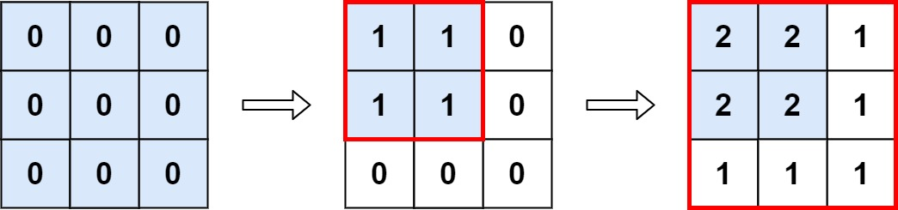

## 一、题目
`598.范围求和 II`

给你一个` m x n` 的矩阵 `M `，初始化时所有的 `0 `和一个操作数组 `op `，其中 `ops[i] = [ai, bi]` 意味着当所有的` 0 <= x < ai `和 `0 <= y < bi` 时， `M[x][y]` 应该加 `1`。

在 执行完所有操作后 ，计算并返回 矩阵中最大整数的个数 。

 

示例 1:


```
输入: m = 3, n = 3，ops = [[2,2],[3,3]]
输出: 4
解释: M 中最大的整数是 2, 而且 M 中有4个值为2的元素。因此返回 4。
```

示例 2:

```
输入: m = 3, n = 3, ops = [[2,2],[3,3],[3,3],[3,3],[2,2],[3,3],[3,3],[3,3],[2,2],[3,3],[3,3],[3,3]]
输出: 4
```

示例 3:
```
输入: m = 3, n = 3, ops = []
输出: 9
```

提示:
```
1 <= m, n <= 4 * 104
0 <= ops.length <= 104
ops[i].length == 2
1 <= ai <= m
1 <= bi <= n
```

来源：力扣（LeetCode）
链接：https://leetcode-cn.com/problems/range-addition-ii
## 二、分析解题思路

### 思路一
首先来读题目：
- 给定一个`m*n`的二维数组`M`，每项的值初始化是0
- 再给定一个操作的数组：op，也是一个二维数组
- op中的ops[i] = [ai, bi]，当所有的`0 <= x < ai`和 `0 <= y < bi` 的时候时， M[x][y] 应该加 1。

综上：每一次的操作，给定一个`(a,b)`,遍历，将`M`矩阵中的所有满足 `0<= i <= a` 及 `0<= j <=b`的位置即`(i，j)`全部加上1。

因为`a`,`b`都是正数，所以(0,0)总是满足条件，并且最终位置(0,0)的数值就等于操作的次数。

所以，我们的任务就等价于找出`M`矩阵中所有满足要求的次数刚好等于操作次数的位置。

假设：`k`,那么`(i,j)`就需要满足以下调价

```
{ 0<= i <= a0, 0<= i <= a1,···，0<= i <= ak-1
{ 0<= j <= b0, 0<= j <= b1,···，0<= j <= bk-1
```

等价于：
```
{ 0<= i <= mink(a)
{ 0<= j <= mink(b)
```

这样，我们就只需要求出`a`和`b`中的最小值，分别标记为`mink(a)`和`mink(b)`,所以满足`(1)`式的`(i,j)`一共有 `minka * minkb`对。


## 三、JS代码

### 3.1 思路一：维护所有操作的交集
```
/**
 * @param {number} m
 * @param {number} n
 * @param {number[][]} ops
 * @return {number}
 */
 var maxCount = function(m, n, ops) {
    let mina = m, minb = n;
    for(const op of ops){
        mina = Math.min(mina,op[0]);
        minb = Math.min(minb,op[1]);
        console.log("op:",op)
        console.log("op[0]: ",op[0]," op[1]: ",op[1])
        console.log("mina: ",mina," minb: ",minb)
    }
    return mina * minb;
};

let m = 3, n = 3, ops=[[2,2],[3,3]];
let result = maxCount(m,n,ops);
console.log(result)
```
**复杂度：**

时间复杂度：O(k),其中k是数组`ops`的长度

空间复杂度：O(1)

## 四、总结


### 4.1 知识点

### 4.2 最优解
